# Code Quiz
A website that gives a user a quiz and scores them against a timer

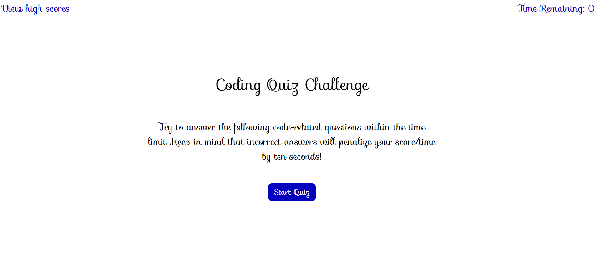

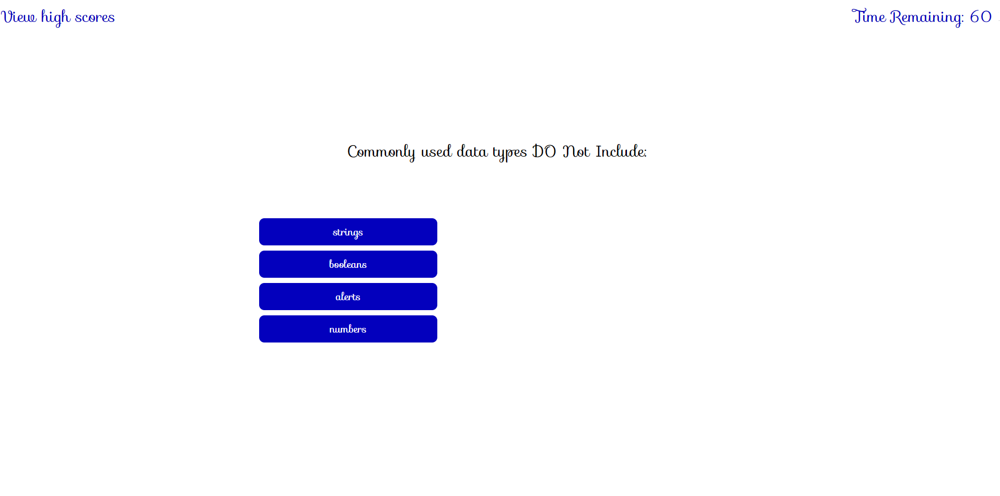

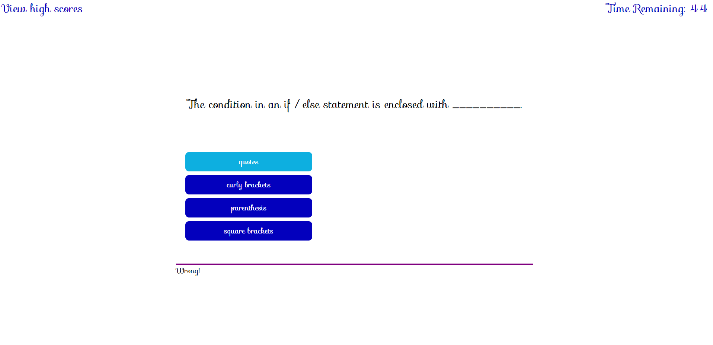

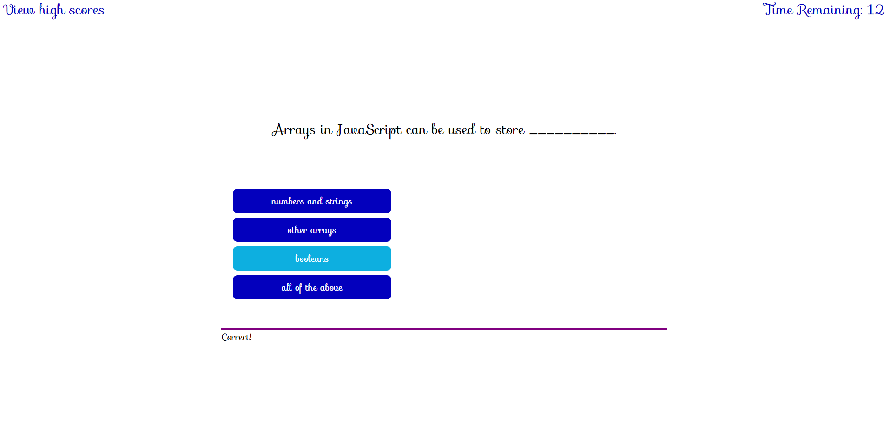

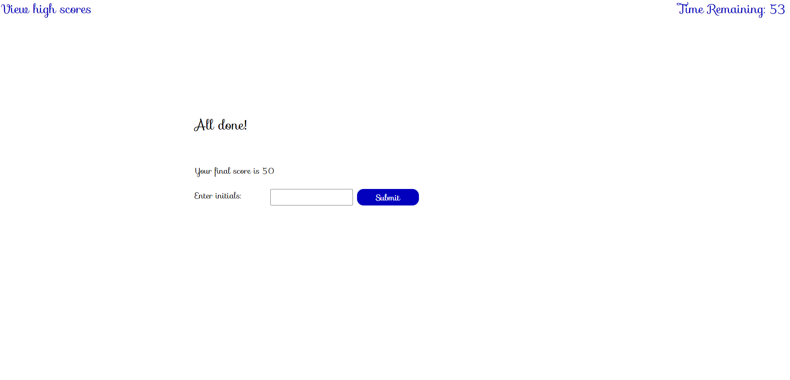

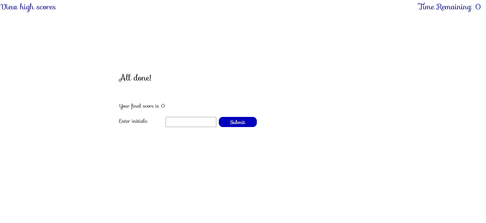

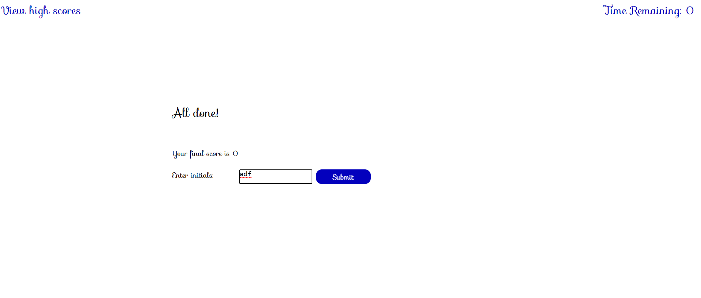

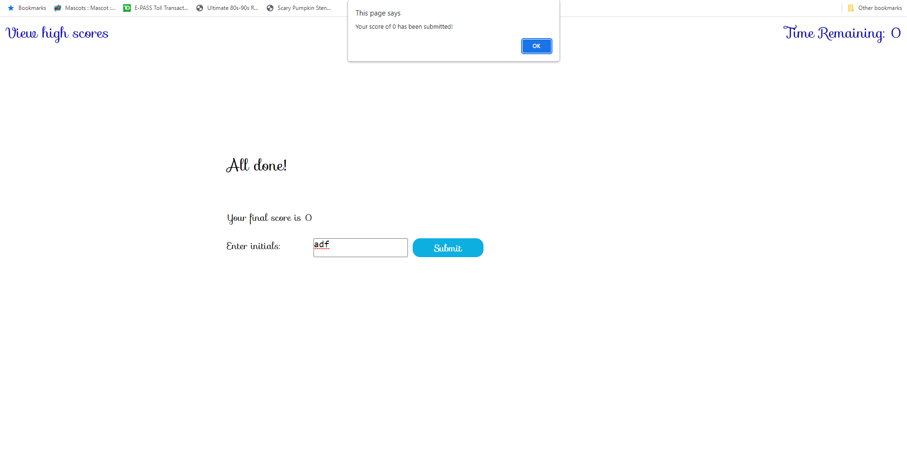

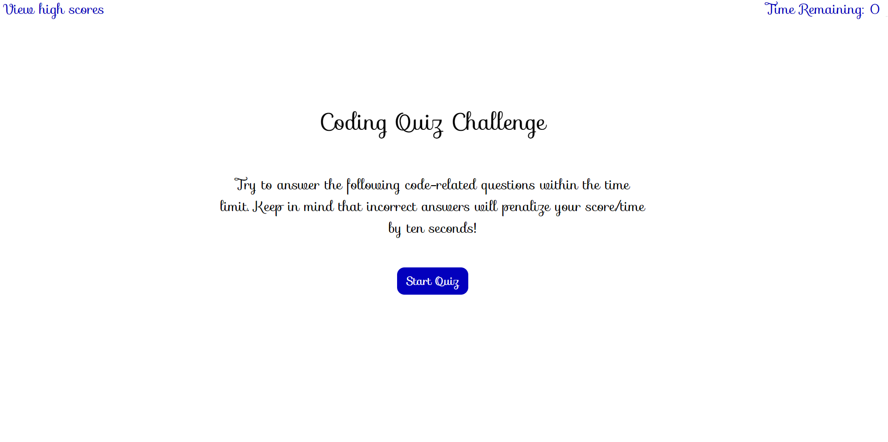

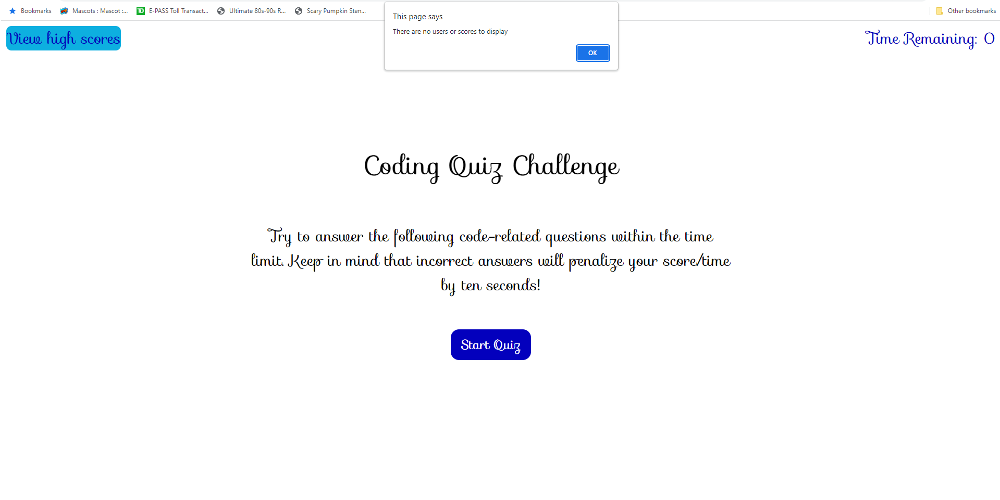

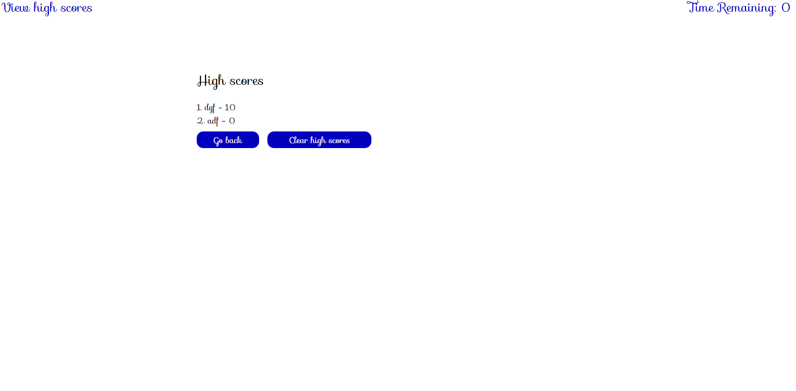

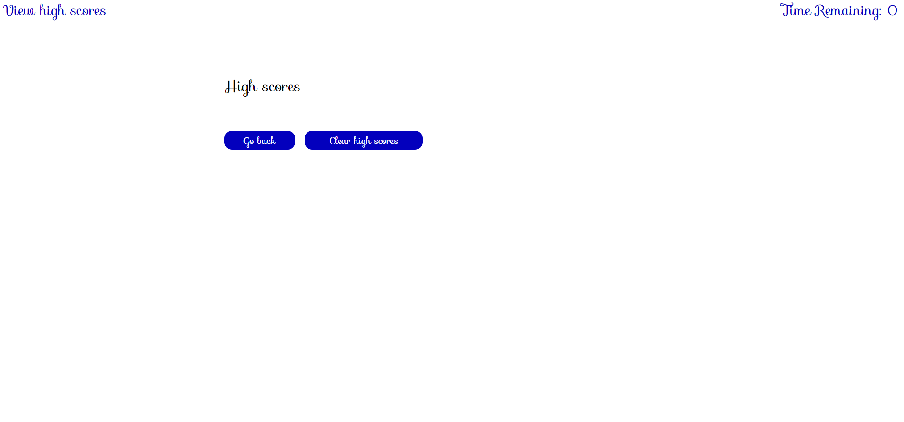

## Viewed the requirements; Started implementing functionality and design aspects

* I created several html id tags and buttons so that the quiz could acces them and display the proper requirements. Implemented future designs to help in case more questions and answers need to be installed. Made easy user interfaces so page is not dificult to navigate and extremely understandable on every level.

## Error detection; Making sure code would not crash

* I implemented a series of error checking to prevent anything from being entered incorrectly or having loading or saving issues to the localstorage.

# Links to deployed application

## GitHub repository for Module Challenge Four
[Github Repo](https://github.com/Quaz711/CodeQuiz)

## Live website for Module Challenge Four
[Live Website](https://quaz711.github.io/CodeQuiz/)